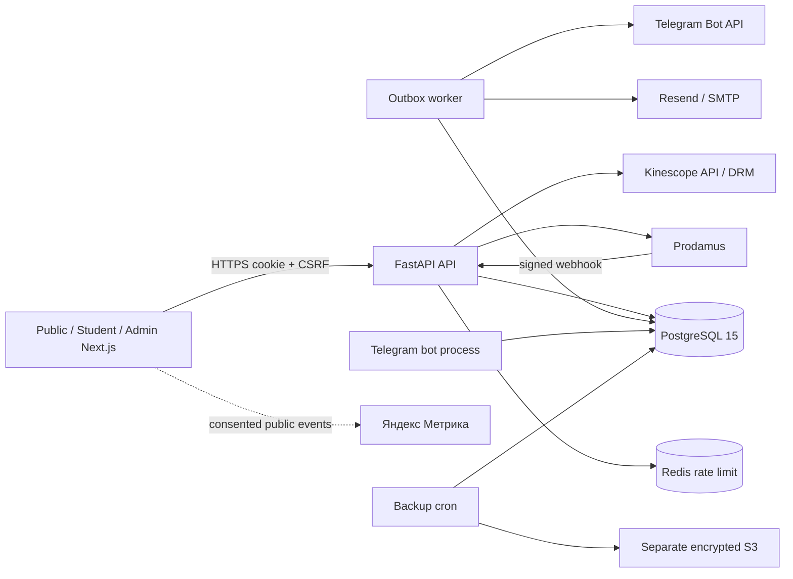

# Техническая архитектура Lucy Nails Academy

> **Версия:** 2.0
> **Дата:** 26.08.2026
> **Статус:** соответствует ветке `feat/production-readiness`
> **Alembic head:** `1b8c9d0e1f2a`

## 1. Контекст системы

Секреты находятся только в environment variables. Frontend не получает Prodamus, Kinescope DRM, Telegram, email, JWT/MFA или S3 secrets.

## 2. Runtime-компоненты

| Компонент | Назначение | Команда |
|---|---|---|
| `frontend` | Next.js 16 App Router, React 19 | `npm start` |
| `backend web` | FastAPI, auth, content, commerce, admin API | `alembic upgrade head && uvicorn ...` |
| `worker` | durable email/Telegram outbox и scheduled delivery | `python -m app.workers.outbox` |
| `bot` | Telegram account linking и команды | `python -m app.bot.main` |
| `PostgreSQL 15` | источник истины | managed service |
| `Redis 7` | общий distributed rate-limit | managed service |
| `backup` | pg_dump, SHA-256, encrypted S3, alert | `ops/backup/Dockerfile` |

Frontend и API могут масштабироваться горизонтально. Stateful rate limit не хранится в памяти production-инстанса. Worker использует блокировку outbox сообщений, dedupe keys и повторные попытки.

## 3. Доменная модель

### Identity и команда

- `users` — аккаунт и legacy role для совместимости.
- `roles`, `permissions`, `user_role_assignments`, `role_permissions` — канонический RBAC.
- `mfa_credentials` — зашифрованный TOTP secret и хеши резервных кодов.
- `auth_sessions` — хеш refresh token, устройство, срок и отзыв.
- `audit_logs` — append-only административные действия: actor, объект, before/after, причина, correlation ID.

### Курс и обучение

- `courses` — публикация, цены тарифов, настраиваемый `access_days`, поля лендинга.
- `modules`, `lessons` — порядок, Kinescope ID, duration, preview и описание.
- `progress` — просмотр и завершение урока.
- `certificates` — номер, артефакты, выдача, повторная выдача и отзыв.
- `gallery_items` — управляемая галерея лендинга.

### Commerce и доступ

- `orders` — immutable checkout snapshot: курс, тариф, email/phone, сумма, валюта, срок и first/last UTM. Публичный статус защищён хешированным непрогнозируемым token.
- `payment_events` — идемпотентный очищенный журнал provider events и hash оригинала.
- `purchases` — подтверждённая финансовая история, связанная с заказом.
- `entitlements` — отдельное право доступа: источник, статус, начало, окончание, отзыв и причина.
- `refund_requests` — внутренний workflow возврата; provider operation выполняется в Prodamus.
- `runtime_settings` — малая allow-list несекретных переключателей; сейчас `checkout_enabled`.

### CRM, доставка и аналитика

- `student_notes`, `student_tags`, `student_tag_assignments` — операционная CRM.
- `outbox_messages`, `delivery_attempts` — email/Telegram очередь, retries и dead letter.
- `telegram_link_tokens` — одноразовая привязка Telegram; token хранится только как hash.
- `analytics_events` — дедуплицированные PII-free события с event/source/time/user/order/course/lesson/UTM.

## 4. Транзакция оплаты

1. Backend проверяет runtime kill switch и опубликованный курс.
2. Создаётся `Order` со снимком цены, валюты и срока. Клиент получает Prodamus URL и status token.
3. Success page опрашивает `/api/payments/orders/{id}/status`; редирект сам по себе ничего не выдаёт.
4. Webhook проверяет HMAC, status, order, snapshot amount/currency и event id/hash.
5. В одной DB-транзакции создаются/обновляются `PaymentEvent`, `Purchase`, `Entitlement`, server analytics event и outbox.
6. Worker отдельно отправляет activation/access email и Telegram. Неуспех внешнего канала не откатывает оплату или доступ.
7. Повторный webhook возвращает успешный идемпотентный ответ без второй покупки, доступа или уведомления.

Ручная выдача использует только `Entitlement`. Проверка доступа (`require_course_access`) читает активный entitlement, а не делает вывод из факта существования платежа.

## 5. Authentication, CSRF и RBAC

- Access/refresh tokens передаются HttpOnly Secure cookies; frontend использует видимый несекретный session marker только для UX.
- Изменяющие cookie-auth запросы требуют CSRF token; CORS ограничен allow-list frontend origins.
- `COOKIE_DOMAIN`, `TRUSTED_HOSTS`, `CORS_ORIGINS`, HTTPS и production secrets валидируются при старте.
- Reverse proxy доверяется только через ожидаемую deployment-конфигурацию; IP rate limit общий через Redis.
- Owner/admin не завершают вход без TOTP MFA. Refresh token привязан к отзываемой `AuthSession`.
- FastAPI dependencies проверяют конкретные permissions; скрытие кнопки во frontend не является контролем доступа.
- Последнее назначение owner удалить нельзя.

## 6. API-контуры

| Prefix | Назначение |
|---|---|
| `/api/auth` | register/login/refresh/logout, activation, password, MFA, sessions |
| `/api/courses`, `/modules`, `/lessons` | каталог, уроки, видео и прогресс |
| `/api/payments`, `/purchases` | checkout, status, webhook, legacy compatibility |
| `/api/analytics` | публичные consented события без PII |
| `/api/telegram` | link token и profile integration |
| `/api/certificates` | student certificate lifecycle |
| `/api/admin` | CRM, orders, access, content, reports, refunds, certificates, notifications, RBAC, audit, system |
| `/api/integrations/kinescope` | DRM authorization backend |

Административные списки используют серверные фильтры/пагинацию; отчёты принимают диапазоны дат и предоставляют CSV там, где это предусмотрено UI.

## 7. Аналитика и privacy

PostgreSQL — источник financial truth. Gross revenue — подтверждённые покупки; refunds — подтверждённые refund requests; net — разность. Воронка, UTM, тарифы и когорты строятся поверх `orders`, server events и progress.

Яндекс Метрика загружается только на публичной части после consent категории `analytics`. Версия consent хранится локально, пользователь может отозвать согласие. Кабинет, админка и формы с контактными данными не должны попадать в Webvisor.

## 8. Надёжность и наблюдаемость

- Каждый HTTP request получает/возвращает correlation ID; JSON log содержит метод, path без query, status и duration.
- В системе видны последний PaymentEvent, outbox pending/dead-letter и состояние несекретных интеграций.
- Owner Telegram alerts используются для webhook/outbox/integration/backup ошибок.
- Checkout отключается DB-переключателем без deploy, webhook остаётся доступен.
- Backup: ежедневный custom `pg_dump`, SHA-256, S3 server-side encryption; еженедельная отдельная versioned копия.
- Runbooks: [`04_Setup_Ops/RUNBOOKS.md`](04_Setup_Ops/RUNBOOKS.md), restore: [`04_Setup_Ops/BACKUP_RESTORE.md`](04_Setup_Ops/BACKUP_RESTORE.md).

## 9. Среды и зависимости

- `development`: `compose.dev.yml` поднимает PostgreSQL 15 и Redis 7; mock Kinescope допустим.
- `test`: pytest использует отдельную PostgreSQL DB; никакие production endpoints не вызываются.
- `staging`: отдельные DB/Redis/Prodamus demo/email domain/Telegram/Kinescope, mock Kinescope запрещён.
- `production`: конфигурация fail-closed, Telegram owner alert и Redis обязательны.

Python runtime зафиксирован на 3.11, runtime/dev/tooling dependencies разделены lock-файлами. CI выполняет Ruff, pip-audit, Alembic single-head + downgrade/upgrade, полный pytest, ESLint, Vitest, npm audit, Next build и Playwright Chromium/WebKit.

## 10. Осознанный техдолг

- `frontend/src/lib/api.ts` остаётся крупным и должен быть разделён по доменам без изменения контрактов.
- Старый `backend/app/api/admin.py` частично сосуществует с новыми domain routers; дальнейшая декомпозиция — P2.
- Pydantic `from_orm`/class `Config` дают deprecation warnings и должны быть переведены на v2 API до Pydantic 3.
- Фактическая production topology, S3 restore, load result и provider delivery подтверждаются только после staging/deploy; кодовая готовность не равна эксплуатационной.
