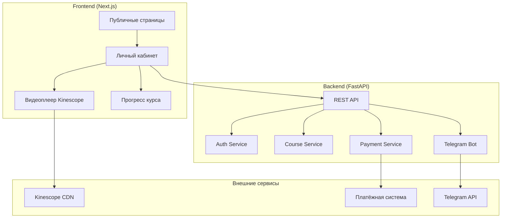
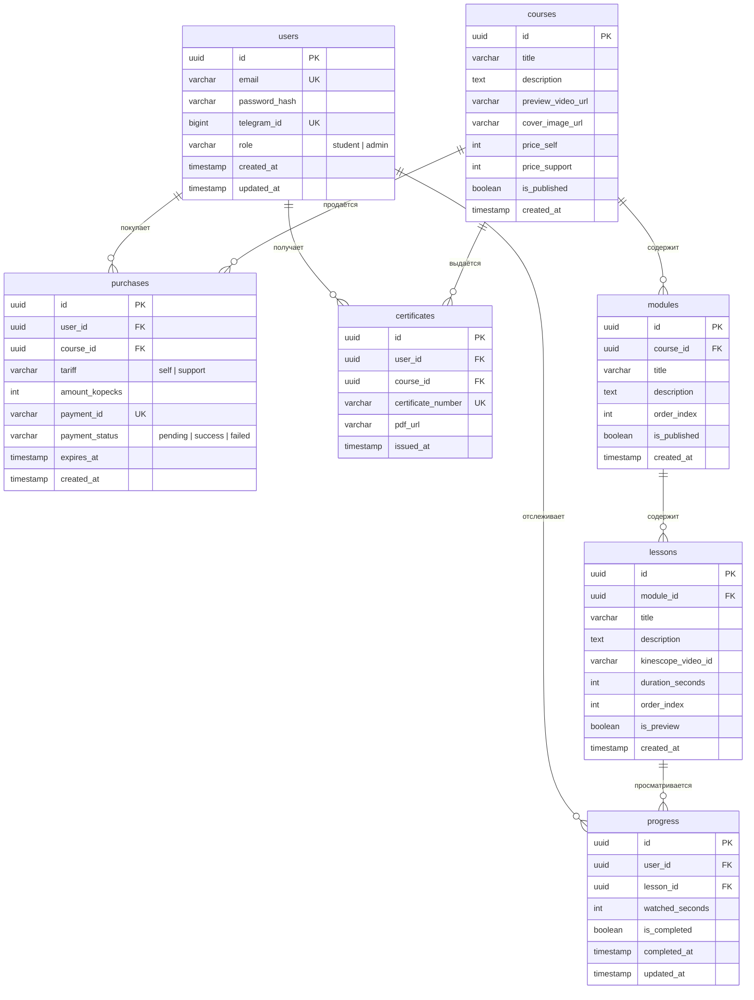

# Техническая Архитектура: Платформа видео-курсов

> **Версия:** 1.2  
> **Дата:** 22.01.2026  
> **Статус:** Утверждён

---

## 1. Обзор системы

Платформа для продажи видео-курсов по дизайну ногтей с защитой контента через Kinescope.



---

## 2. Схема базы данных (PostgreSQL)

### 2.1 ER-диаграмма



### 2.2 Описание таблиц

| Таблица | Назначение |
|---------|------------|
| `users` | Пользователи системы (ученики и админы) |
| `courses` | Курсы с ценами для каждого тарифа |
| `modules` | Блоки (модули) курса, группирующие уроки по темам |
| `lessons` | Уроки с ссылками на Kinescope, принадлежат модулю |
| `purchases` | Покупки с датой истечения доступа |
| `progress` | Прогресс просмотра уроков |
| `certificates` | Выданные сертификаты |

### 2.3 Контроль доступа (FastAPI Dependencies)

> **Решение:** Права доступа реализуются через FastAPI Dependencies, а не RLS.  
> **Причина:** RLS требует Supabase-specific синтаксис (`auth.uid()`), что усложняет разработку и отладку.

```python
# backend/app/core/dependencies.py

from fastapi import Depends, HTTPException, status
from fastapi.security import OAuth2PasswordBearer

oauth2_scheme = OAuth2PasswordBearer(tokenUrl="/api/auth/login")

async def get_current_user(token: str = Depends(oauth2_scheme)) -> User:
    """Извлекает текущего пользователя из JWT токена."""
    # Декодирование JWT и получение user_id
    # Запрос пользователя из БД
    pass

async def require_admin(user: User = Depends(get_current_user)) -> User:
    """Проверяет, что пользователь имеет роль admin."""
    if user.role != "admin":
        raise HTTPException(
            status_code=status.HTTP_403_FORBIDDEN,
            detail="Admin access required"
        )
    return user

async def require_course_access(
    course_id: UUID,
    user: User = Depends(get_current_user),
    db: AsyncSession = Depends(get_db)
) -> Purchase:
    """Проверяет, что у пользователя есть активная покупка курса."""
    purchase = await db.execute(
        select(Purchase).where(
            Purchase.user_id == user.id,
            Purchase.course_id == course_id,
            Purchase.payment_status == "success",
            Purchase.expires_at > datetime.utcnow()
        )
    )
    if not purchase.scalar_one_or_none():
        raise HTTPException(
            status_code=status.HTTP_403_FORBIDDEN,
            detail="Course access required"
        )
    return purchase
```

**Использование в эндпоинтах:**
```python
@router.get("/lessons/{lesson_id}")
async def get_lesson(
    lesson_id: UUID,
    user: User = Depends(get_current_user),
    access: Purchase = Depends(require_course_access)  # Автоматическая проверка
):
    ...

@router.get("/admin/users")
async def list_users(admin: User = Depends(require_admin)):
    ...
```

---

## 3. Структура API (FastAPI)

### 3.1 Эндпоинты

#### Аутентификация
| Метод | Путь | Описание |
|-------|------|----------|
| POST | `/api/auth/register` | Регистрация |
| POST | `/api/auth/login` | Вход |
| POST | `/api/auth/logout` | Выход |
| GET | `/api/auth/me` | Текущий пользователь |

#### Курсы
| Метод | Путь | Описание |
|-------|------|----------|
| GET | `/api/courses` | Список курсов |
| GET | `/api/courses/{id}` | Детали курса (с модулями) |

#### Модули
| Метод | Путь | Описание |
|-------|------|----------|
| GET | `/api/courses/{courseId}/modules` | Список модулей курса |
| GET | `/api/modules/{id}` | Детали модуля (с уроками) |

#### Уроки
| Метод | Путь | Описание |
|-------|------|----------|
| GET | `/api/modules/{moduleId}/lessons` | Уроки модуля |
| GET | `/api/lessons/{id}` | Урок с видео-токеном |
| POST | `/api/lessons/{id}/progress` | Обновить прогресс |

#### Покупки
| Метод | Путь | Описание |
|-------|------|----------|
| POST | `/api/purchases/create` | Создать платёж |
| POST | `/api/purchases/webhook` | Webhook от платёжки |
| GET | `/api/purchases/my` | Мои покупки |

#### Telegram
| Метод | Путь | Описание |
|-------|------|----------|
| POST | `/api/telegram/link` | Привязать Telegram |
| POST | `/api/telegram/webhook` | Webhook от бота |

#### Админ
| Метод | Путь | Описание |
|-------|------|----------|
| GET | `/api/admin/users` | Список пользователей |
| GET | `/api/admin/users/{id}` | Детали пользователя |
| GET | `/api/admin/analytics` | Аналитика |
| CRUD | `/api/admin/courses/*` | Управление курсами |
| CRUD | `/api/admin/modules/*` | Управление модулями |
| CRUD | `/api/admin/lessons/*` | Управление уроками |

### 3.2 TypeScript Interfaces

```typescript
// === Пользователь ===
interface User {
  id: string;
  email: string;
  telegramId?: number;
  role: 'student' | 'admin';
  createdAt: string;
}

// === Курс ===
interface Course {
  id: string;
  title: string;
  description: string;
  previewVideoUrl?: string;
  coverImageUrl?: string;
  priceSelf: number;        // в рублях
  priceSupport: number;     // в рублях
  modulesCount: number;
  lessonsCount: number;
  totalDuration: number;    // в секундах
  modules?: Module[];       // включается при полном запросе
}

// === Модуль (Блок) ===
interface Module {
  id: string;
  courseId: string;
  title: string;
  description?: string;
  orderIndex: number;
  lessonsCount: number;
  totalDuration: number;    // в секундах
  lessons?: Lesson[];       // включается при полном запросе
}

// === Урок ===
interface Lesson {
  id: string;
  moduleId: string;
  title: string;
  description?: string;
  durationSeconds: number;
  orderIndex: number;
  isPreview: boolean;
  kinescopeVideoId?: string; // только для авторизованных с доступом
}

// === Покупка ===
interface Purchase {
  id: string;
  courseId: string;
  tariff: 'self' | 'support';
  amount: number;
  expiresAt: string;
  createdAt: string;
}

// === Прогресс ===
interface Progress {
  lessonId: string;
  watchedSeconds: number;
  isCompleted: boolean;
}

// === Прогресс курса (агрегированный) ===
interface CourseProgress {
  courseId: string;
  completedLessons: number;
  totalLessons: number;
  percentComplete: number;
  moduleProgress: ModuleProgress[];
}

interface ModuleProgress {
  moduleId: string;
  completedLessons: number;
  totalLessons: number;
  percentComplete: number;
}

// === Сертификат ===
interface Certificate {
  id: string;
  courseId: string;
  certificateNumber: string;
  pdfUrl: string;
  issuedAt: string;
}
```

---

## 4. Структура проекта

### 4.1 Frontend (Next.js App Router)

```
frontend/
├── app/
│   ├── (public)/              # Публичные страницы
│   │   ├── page.tsx           # Главная
│   │   ├── courses/
│   │   │   └── [id]/page.tsx  # Страница курса (с модулями)
│   │   └── auth/
│   │       ├── login/page.tsx
│   │       └── register/page.tsx
│   │
│   ├── (protected)/           # Требуют авторизации
│   │   ├── dashboard/page.tsx # Личный кабинет
│   │   ├── courses/
│   │   │   └── [id]/
│   │   │       ├── page.tsx   # Мой курс (список модулей)
│   │   │       ├── modules/
│   │   │       │   └── [moduleId]/page.tsx  # Модуль (список уроков)
│   │   │       └── lessons/
│   │   │           └── [lessonId]/page.tsx  # Урок (видео)
│   │   └── certificates/page.tsx
│   │
│   ├── admin/                 # Админ-панель
│   │   ├── page.tsx           # Дашборд
│   │   ├── users/page.tsx
│   │   ├── courses/
│   │   │   ├── page.tsx       # Список курсов
│   │   │   └── [id]/
│   │   │       ├── page.tsx   # Редактирование курса
│   │   │       └── modules/page.tsx  # Управление модулями
│   │   └── analytics/page.tsx
│   │
│   ├── layout.tsx
│   └── globals.css
│
├── components/
│   ├── ui/                    # Базовые UI компоненты
│   │   ├── Button.tsx
│   │   ├── Card.tsx
│   │   ├── Input.tsx
│   │   └── Modal.tsx
│   │
│   ├── course/                # Компоненты курса
│   │   ├── CourseCard.tsx
│   │   ├── ModuleList.tsx
│   │   ├── ModuleCard.tsx
│   │   ├── LessonList.tsx
│   │   └── VideoPlayer.tsx
│   │
│   ├── progress/
│   │   ├── ProgressBar.tsx
│   │   └── ModuleProgressBar.tsx
│   │
│   └── layout/
│       ├── Header.tsx
│       ├── Footer.tsx
│       └── Sidebar.tsx
│
├── lib/
│   ├── api.ts                 # API клиент
│   ├── auth.ts                # Работа с токенами
│   └── kinescope.ts           # Интеграция Kinescope
│
├── hooks/
│   ├── useAuth.ts
│   ├── useCourse.ts
│   ├── useModule.ts
│   └── useProgress.ts
│
└── types/
    └── index.ts               # Все TypeScript типы
```

### 4.2 Backend (FastAPI)

```
backend/
├── app/
│   ├── main.py                # Точка входа
│   ├── config.py              # Настройки
│   │
│   ├── api/
│   │   ├── __init__.py
│   │   ├── auth.py            # /api/auth/*
│   │   ├── courses.py         # /api/courses/*
│   │   ├── modules.py         # /api/modules/*
│   │   ├── lessons.py         # /api/lessons/*
│   │   ├── purchases.py       # /api/purchases/*
│   │   ├── telegram.py        # /api/telegram/*
│   │   └── admin.py           # /api/admin/*
│   │
│   ├── services/
│   │   ├── auth_service.py
│   │   ├── course_service.py
│   │   ├── module_service.py
│   │   ├── payment_service.py
│   │   ├── kinescope_service.py
│   │   ├── telegram_service.py
│   │   └── certificate_service.py
│   │
│   ├── models/
│   │   ├── user.py
│   │   ├── course.py
│   │   ├── module.py
│   │   ├── lesson.py
│   │   ├── purchase.py
│   │   ├── progress.py
│   │   └── certificate.py
│   │
│   ├── schemas/               # Pydantic модели
│   │   ├── user.py
│   │   ├── course.py
│   │   ├── module.py
│   │   └── ...
│   │
│   ├── core/
│   │   ├── database.py        # Подключение к PostgreSQL
│   │   ├── redis.py           # Redis для сессий
│   │   └── security.py        # JWT, хеширование
│   │
│   └── utils/
│       └── notifications.py   # Telegram уведомления
│
├── tests/
├── alembic/                   # Миграции БД
└── requirements.txt
```

---

## 5. Интеграции

### 5.1 Kinescope

```python
# backend/app/services/kinescope_service.py

class KinescopeService:
    """Работа с Kinescope API для защиты видео."""
    
    async def get_embed_url(self, video_id: str, user_email: str) -> str:
        """
        Генерирует URL для embed с водяным знаком.
        
        Args:
            video_id: ID видео в Kinescope
            user_email: Email пользователя для watermark
        
        Returns:
            URL для iframe с signed token
        """
        pass

    async def get_video_stats(self, video_id: str) -> dict:
        """Получает статистику просмотров."""
        pass
```

### 5.2 Платёжная система — Prodamus

**Сайт:** https://prodamus.ru  
**Документация:** https://help.prodamus.ru

**Особенности:**
- ✅ Работает с ИП/самозанятыми и юрлицами
- ✅ Платёжная ссылка без сайта
- ✅ Webhooks для уведомлений о платежах
- ✅ Работает в РФ/СНГ

```python
# backend/app/services/payment_service.py

class ProdamusService:
    """Интеграция с Prodamus."""
    
    def __init__(self, api_key: str, secret_key: str):
        self.api_key = api_key
        self.secret_key = secret_key
        self.base_url = "https://api.prodamus.ru"
    
    async def create_payment_link(
        self, 
        user_id: str, 
        course_id: str, 
        tariff: str,
        amount: int,
        customer_email: str
    ) -> str:
        """
        Создаёт ссылку на оплату.
        
        Args:
            user_id: ID пользователя
            course_id: ID курса
            tariff: 'self' | 'support'
            amount: Сумма в рублях
            customer_email: Email покупателя
        
        Returns:
            URL платёжной формы Prodamus
        """
        pass

    async def verify_webhook_signature(self, data: dict, signature: str) -> bool:
        """Проверяет подпись webhook от Prodamus."""
        pass

    async def process_webhook(self, data: dict) -> None:
        """
        Обрабатывает webhook от Prodamus.
        
        Действия при успешной оплате:
        1. Создать запись в purchases
        2. Отправить уведомление в Telegram
        3. Если тариф 'support' — отправить ссылку на закрытую группу
        """
        pass
```

### 5.3 Telegram Bot + Закрытая группа

**Модель:** Закрытая Telegram-группа для тарифа "С поддержкой"

```python
# backend/app/services/telegram_service.py

class TelegramService:
    """Telegram бот для уведомлений."""
    
    def __init__(self, bot_token: str, support_group_invite_link: str):
        self.bot_token = bot_token
        self.support_group_invite_link = support_group_invite_link
    
    async def send_purchase_notification(self, user: User, course: Course, tariff: str):
        """
        Уведомление о покупке.
        Если tariff == 'support', добавляет ссылку на закрытую группу.
        """
        pass

    async def send_expiry_reminder(self, user: User, days_left: int):
        """Напоминание об окончании доступа."""
        pass

    async def send_support_chat_link(self, user: User):
        """Ссылка на закрытый чат (для тарифа С поддержкой)."""
        pass
```

---

## 6. Безопасность

| Аспект | Решение |
|--------|---------|
| **Аутентификация** | JWT токены (access + refresh) |
| **Пароли** | bcrypt хеширование |
| **API Rate Limiting** | Redis + slowapi |
| **CORS** | Только разрешённые домены |
| **SQL Injection** | SQLAlchemy ORM, параметризованные запросы |
| **XSS** | Санитизация на фронте, CSP headers |
| **Видео-защита** | Kinescope DRM + signed URLs + watermark |

---

## 7. Принятые решения

| Вопрос | Решение |
|--------|--------|
| **Платёжная система** | Prodamus (https://prodamus.ru) — аккаунт самозанятого |
| **Видеохостинг** | Kinescope (DRM-защита, водяные знаки) |
| **Домен** | lucysmirnova.ru |
| **Хостинг** | Railway |
| **Закрытый чат** | Закрытая Telegram-группа |
| **CRM** | Собственная админ-панель с кастомной аналитикой (без внешних CRM) |
| **Сертификат** | Отложено (шаблон не готов) |
| **Структура курса** | Курс → Модули (блоки) → Уроки |
