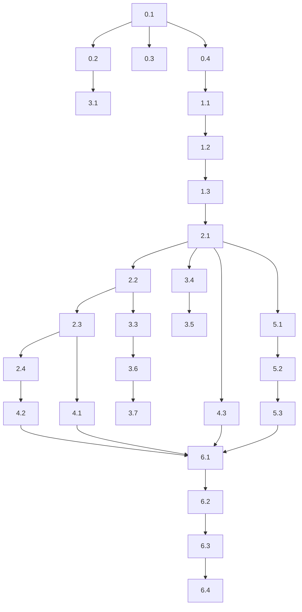

# Implementation Plan: Платформа видео-курсов

> **Версия:** 1.0  
> **Дата:** 22.01.2026  
> **На основе:** [PRD.md](./PRD.md) v1.2, [ARCHITECTURE.md](./ARCHITECTURE.md) v1.2

---

## Обзор фаз

| Фаза | Название | Длительность | Зависимости |
|------|----------|--------------|-------------|
| 0 | Setup | 2-3 дня | — |
| 1 | Database | 3-4 дня | Фаза 0 |
| 2 | Backend Core | 1-1.5 недели | Фаза 1 |
| 3 | Frontend Core | 1.5-2 недели | Фаза 2 |
| 4 | Integrations | 1 неделя | Фаза 2, 3 |
| 5 | Admin Panel | 1 неделя | Фаза 2, 3 |
| 6 | Polish & Deploy | 1 неделя | Все |

**Итого:** 6-8 недель

---

## Фаза 0: Setup (2-3 дня)

### Задача 0.1: Инициализация репозитория
**Файлы:** Корень проекта  
**Критерии приёмки:**
- [ ] Создан Git-репозиторий с `.gitignore`
- [ ] Структура папок: `frontend/`, `backend/`, `docs/`
- [ ] README.md с описанием проекта

**Проверка:**
```bash
git status
ls -la
```

---

### Задача 0.2: Setup Frontend (Next.js)
**Компоненты из ARCHITECTURE:** `frontend/` структура  
**Критерии приёмки:**
- [ ] Next.js 14+ с App Router
- [ ] TypeScript настроен
- [ ] Tailwind CSS подключён
- [ ] Структура папок по ARCHITECTURE.md: `app/`, `components/`, `lib/`, `hooks/`, `types/`
- [ ] ESLint + Prettier настроены

**Команды:**
```bash
cd frontend
npx create-next-app@latest . --typescript --tailwind --app --eslint
npm run dev
```

**Проверка:** Открыть `http://localhost:3000` в браузере

---

### Задача 0.3: Setup Backend (FastAPI)
**Компоненты из ARCHITECTURE:** `backend/` структура  
**Критерии приёмки:**
- [ ] Python 3.11+ виртуальное окружение
- [ ] FastAPI + Uvicorn установлены
- [ ] Структура папок: `app/api/`, `app/services/`, `app/models/`, `app/schemas/`, `app/core/`
- [ ] `requirements.txt` с зависимостями

**Команды:**
```bash
cd backend
python -m venv venv
venv\Scripts\activate  # Windows
pip install fastapi uvicorn sqlalchemy asyncpg alembic pydantic python-jose bcrypt redis
pip freeze > requirements.txt
uvicorn app.main:app --reload
```

**Проверка:** `GET http://localhost:8000/docs` — Swagger UI

---

### Задача 0.4: Docker Compose для локальной разработки
**Критерии приёмки:**
- [ ] PostgreSQL 15 контейнер
- [ ] Redis контейнер
- [ ] docker-compose.yml в корне

**Команды:**
```bash
docker-compose up -d
docker-compose ps
```

---

## Фаза 1: Database (3-4 дня)

### Задача 1.1: Модели SQLAlchemy
**Таблицы из ARCHITECTURE (2.1):** `users`, `courses`, `modules`, `lessons`, `purchases`, `progress`, `certificates`

**Файлы для создания:**
- `backend/app/models/user.py`
- `backend/app/models/course.py`
- `backend/app/models/module.py`
- `backend/app/models/lesson.py`
- `backend/app/models/purchase.py`
- `backend/app/models/progress.py`
- `backend/app/models/certificate.py`

**Критерии приёмки:**
- [ ] Все 7 таблиц описаны как SQLAlchemy модели
- [ ] Связи: `courses` → `modules` → `lessons`
- [ ] FK определены корректно
- [ ] Типы данных соответствуют ER-диаграмме

**Проверка:**
```python
# В Python REPL
from app.models import *
print(User.__tablename__)  # 'users'
```

---

### Задача 1.2: Alembic миграции
**Критерии приёмки:**
- [ ] Alembic инициализирован
- [ ] Первая миграция создаёт все 7 таблиц
- [ ] Миграция применена к PostgreSQL

**Команды:**
```bash
alembic init alembic
alembic revision --autogenerate -m "Initial schema"
alembic upgrade head
```

**Проверка:**
```sql
\dt  -- в psql: показывает 7 таблиц
```

---

### Задача 1.3: Seed-данные для разработки
**Критерии приёмки:**
- [ ] Скрипт `backend/scripts/seed.py`
- [ ] 1 тестовый курс
- [ ] 3 модуля в курсе
- [ ] 2-3 урока в каждом модуле
- [ ] 1 тестовый пользователь (admin)

**Проверка:**
```bash
python scripts/seed.py
# Затем проверить в БД
```

---

## Фаза 2: Backend Core (1-1.5 недели)

### Задача 2.1: Аутентификация
**Эндпоинты из ARCHITECTURE (3.1):** `/api/auth/*`  
**Файлы:**
- `backend/app/api/auth.py`
- `backend/app/services/auth_service.py`
- `backend/app/core/security.py`

**Критерии приёмки:**
- [ ] POST `/api/auth/register` — регистрация
- [ ] POST `/api/auth/login` — вход, возврат JWT
- [ ] POST `/api/auth/logout` — выход
- [ ] GET `/api/auth/me` — текущий пользователь
- [ ] JWT access + refresh токены
- [ ] Пароли хешируются bcrypt

**Проверка:**
```bash
# Регистрация
curl -X POST http://localhost:8000/api/auth/register \
  -H "Content-Type: application/json" \
  -d '{"email":"test@test.com","password":"test123"}'

# Вход
curl -X POST http://localhost:8000/api/auth/login \
  -H "Content-Type: application/json" \
  -d '{"email":"test@test.com","password":"test123"}'
```

---

### Задача 2.2: API Курсов и Модулей
**Эндпоинты из ARCHITECTURE (3.1):** `/api/courses/*`, `/api/modules/*`  
**Файлы:**
- `backend/app/api/courses.py`
- `backend/app/api/modules.py`
- `backend/app/services/course_service.py`
- `backend/app/services/module_service.py`

**Критерии приёмки:**
- [ ] GET `/api/courses` — список курсов
- [ ] GET `/api/courses/{id}` — курс с модулями
- [ ] GET `/api/courses/{courseId}/modules` — модули курса
- [ ] GET `/api/modules/{id}` — модуль с уроками

**Проверка:**
```bash
curl http://localhost:8000/api/courses
curl http://localhost:8000/api/courses/{id}/modules
```

---

### Задача 2.3: API Уроков и Прогресса
**Эндпоинты из ARCHITECTURE (3.1):** `/api/lessons/*`  
**Файлы:**
- `backend/app/api/lessons.py`
- `backend/app/services/lesson_service.py`

**Критерии приёмки:**
- [ ] GET `/api/modules/{moduleId}/lessons` — уроки модуля
- [ ] GET `/api/lessons/{id}` — урок (видео-токен для авторизованных)
- [ ] POST `/api/lessons/{id}/progress` — обновить прогресс
- [ ] Проверка доступа (есть ли покупка?)

**Проверка:**
```bash
curl -H "Authorization: Bearer {token}" \
  http://localhost:8000/api/lessons/{id}
```

---

### Задача 2.4: API Покупок
**Эндпоинты из ARCHITECTURE (3.1):** `/api/purchases/*`  
**Файлы:**
- `backend/app/api/purchases.py`
- `backend/app/services/payment_service.py`

**Критерии приёмки:**
- [ ] POST `/api/purchases/create` — создать платёж (заглушка)
- [ ] GET `/api/purchases/my` — мои покупки
- [ ] Проверка `expires_at` при доступе к урокам

**Проверка:**
```bash
curl -H "Authorization: Bearer {token}" \
  http://localhost:8000/api/purchases/my
```

---

## Фаза 3: Frontend Core (1.5-2 недели)

### Задача 3.1: Layout и навигация
**Компоненты из ARCHITECTURE (4.1):** `Header.tsx`, `Footer.tsx`, `layout.tsx`  
**Критерии приёмки:**
- [ ] Header с логотипом и навигацией
- [ ] Footer с контактами
- [ ] Responsive дизайн (mobile-first)
- [ ] Дизайн-система из PRD (цвета, типографика)

**Проверка:** Визуальный осмотр в браузере на разных разрешениях

---

### Задача 3.2: Главная страница
**Компоненты из ARCHITECTURE (4.1):** `app/(public)/page.tsx`  
**Критерии приёмки:**
- [ ] Hero-секция с CTA
- [ ] Описание курса
- [ ] Превью блоков (модулей)
- [ ] Секция тарифов

**Проверка:** Открыть `http://localhost:3000`

---

### Задача 3.3: Страница курса
**Компоненты из ARCHITECTURE (4.1):** `app/(public)/courses/[id]/page.tsx`, `ModuleList.tsx`, `ModuleCard.tsx`  
**Критерии приёмки:**
- [ ] Заголовок и описание курса
- [ ] Список модулей (блоков)
- [ ] Для каждого модуля: название, количество уроков, длительность
- [ ] Кнопка "Купить курс"

**Проверка:**
```bash
# Браузер
http://localhost:3000/courses/{id}
```

---

### Задача 3.4: Авторизация (UI)
**Компоненты из ARCHITECTURE (4.1):** `app/(public)/auth/login/page.tsx`, `app/(public)/auth/register/page.tsx`  
**Файлы:**
- `lib/auth.ts` — работа с токенами
- `hooks/useAuth.ts` — хук авторизации

**Критерии приёмки:**
- [ ] Форма входа (email/password)
- [ ] Форма регистрации
- [ ] Сохранение токена в cookies/localStorage
- [ ] Редирект после входа

**Проверка:** Зарегистрироваться и войти через UI

---

### Задача 3.5: Личный кабинет
**Компоненты из ARCHITECTURE (4.1):** `app/(protected)/dashboard/page.tsx`  
**Критерии приёмки:**
- [ ] Список купленных курсов
- [ ] Прогресс по каждому курсу
- [ ] Ссылки на продолжение обучения

**Проверка:** Авторизоваться и открыть `/dashboard`

---

### Задача 3.6: Просмотр курса (модули и уроки)
**Компоненты из ARCHITECTURE (4.1):** 
- `app/(protected)/courses/[id]/page.tsx`
- `app/(protected)/courses/[id]/modules/[moduleId]/page.tsx`
- `app/(protected)/courses/[id]/lessons/[lessonId]/page.tsx`

**Критерии приёмки:**
- [ ] Навигация по модулям
- [ ] Список уроков в модуле
- [ ] Индикация просмотренных уроков
- [ ] Видеоплеер (заглушка без Kinescope)

**Проверка:** Пройти путь: Дашборд → Курс → Модуль → Урок

---

### Задача 3.7: Прогресс-бар
**Компоненты из ARCHITECTURE (4.1):** `ProgressBar.tsx`, `ModuleProgressBar.tsx`  
**Интерфейсы из ARCHITECTURE (3.2):** `CourseProgress`, `ModuleProgress`

**Критерии приёмки:**
- [ ] Прогресс курса (% пройдено)
- [ ] Прогресс каждого модуля
- [ ] Обновление при просмотре урока

**Проверка:** Просмотреть урок, проверить обновление прогресса

---

## Фаза 4: Integrations (1 неделя)

### Задача 4.1: Kinescope интеграция
**Сервис из ARCHITECTURE (5.1):** `KinescopeService`  
**Компонент:** `VideoPlayer.tsx`

**Критерии приёмки:**
- [ ] Получение signed URL для видео
- [ ] Watermark с email пользователя
- [ ] Embed-плеер на странице урока

**Проверка:** Просмотреть видео в уроке с DRM

---

### Задача 4.2: Prodamus интеграция
**Сервис из ARCHITECTURE (5.2):** `ProdamusService`  
**Эндпоинты:** `/api/purchases/create`, `/api/purchases/webhook`

**Критерии приёмки:**
- [ ] Создание платёжной ссылки
- [ ] Обработка webhook
- [ ] Создание записи в `purchases` после успешной оплаты

**Проверка:** Тестовый платёж через sandbox Prodamus

---

### Задача 4.3: Telegram Bot
**Сервис из ARCHITECTURE (5.3):** `TelegramService`  
**Файлы:**
- `backend/app/services/telegram_service.py`
- `backend/app/api/telegram.py`

**Критерии приёмки:**
- [ ] Привязка Telegram к аккаунту
- [ ] Уведомление о покупке
- [ ] Ссылка на закрытую группу (для тарифа "С поддержкой")

**Проверка:** Привязать Telegram и получить тестовое уведомление

---

## Фаза 5: Admin Panel (1 неделя)

### Задача 5.1: Дашборд админа
**Компоненты из ARCHITECTURE (4.1):** `app/admin/page.tsx`  
**Эндпоинты:** `/api/admin/analytics`

**Критерии приёмки:**
- [ ] Общая выручка
- [ ] Количество пользователей
- [ ] Количество покупок
- [ ] Конверсия

**Проверка:** Войти как admin и открыть `/admin`

---

### Задача 5.2: Управление пользователями
**Компоненты из ARCHITECTURE (4.1):** `app/admin/users/page.tsx`  
**Эндпоинты:** `/api/admin/users`

**Критерии приёмки:**
- [ ] Таблица пользователей
- [ ] Фильтры (тариф, статус)
- [ ] Поиск по email
- [ ] Просмотр прогресса пользователя

**Проверка:** Найти пользователя и посмотреть его прогресс

---

### Задача 5.3: Управление контентом
**Компоненты из ARCHITECTURE (4.1):** `app/admin/courses/page.tsx`  
**Эндпоинты:** `/api/admin/courses/*`, `/api/admin/modules/*`, `/api/admin/lessons/*`

**Критерии приёмки:**
- [ ] CRUD для курсов
- [ ] CRUD для модулей
- [ ] CRUD для уроков
- [ ] Загрузка видео в Kinescope (или ввод ID)

**Проверка:** Создать тестовый модуль и урок через UI

---

## Фаза 6: Polish & Deploy (1 неделя)

### Задача 6.1: SEO и Meta
**Критерии приёмки:**
- [ ] Title и meta description на всех страницах
- [ ] Open Graph теги
- [ ] sitemap.xml
- [ ] robots.txt

---

### Задача 6.2: PWA
**Критерии приёмки:**
- [ ] manifest.json
- [ ] Service Worker (offline fallback)
- [ ] Иконки приложения

---

### Задача 6.3: Деплой на Railway
**Критерии приёмки:**
- [ ] Backend деплой (FastAPI)
- [ ] Frontend деплой (Next.js)
- [ ] PostgreSQL на Railway
- [ ] Redis на Railway
- [ ] Environment variables настроены
- [ ] Домен lucysmirnova.ru подключён

**Проверка:** Открыть https://lucysmirnova.ru

---

### Задача 6.4: Тестирование и багфикс
**Критерии приёмки:**
- [ ] E2E тест: регистрация → покупка → просмотр урока
- [ ] Проверка на мобильных устройствах
- [ ] Нагрузочное тестирование (опционально)
- [ ] Исправление найденных багов

---

## Зависимости между задачами



---

## Риски и митигации

| Риск | Вероятность | Митигация |
|------|-------------|-----------|
| Сложности с Kinescope API | Средняя | Заложить 2-3 дня буфера, подготовить fallback на iframe |
| Prodamus webhook не работает | Низкая | Использовать ngrok для тестирования локально |
| Блоки 2 и 7 контента не готовы | Высокая | Показывать "Coming Soon", не блокировать релиз |
| Большой объём контента (25+ уроков) | Средняя | Заложить время на загрузку видео в Kinescope |
